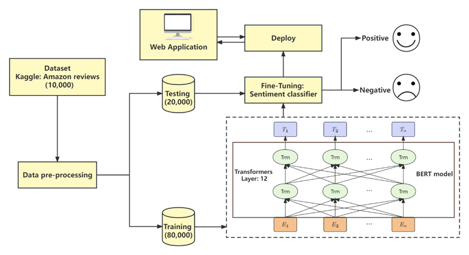
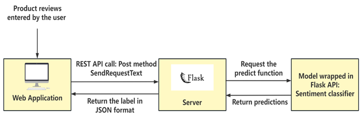
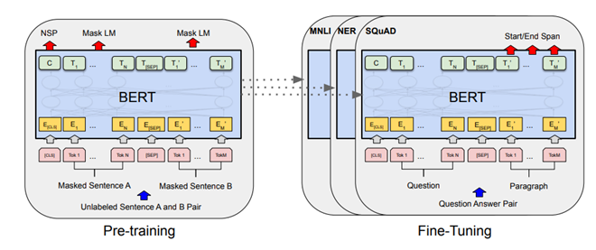
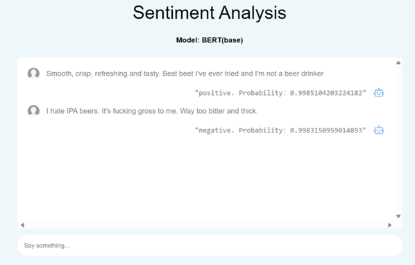
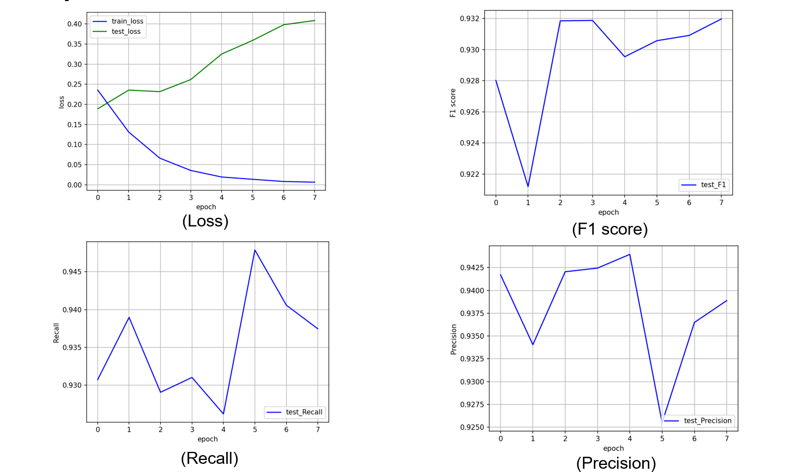
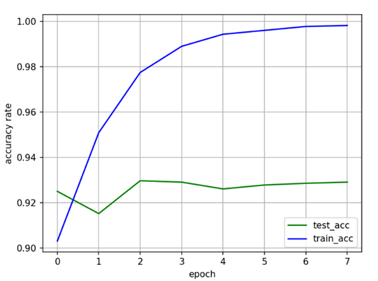

# Sentiment analysis for e-commerce product reviews using BERT ☘️

> Project contains four stage - Data Pre-processing, Model Design, Model Implement, Model Deployment
>
> Tech stack: HTML, CSS, JavaScript, Python, Flask, Pytorch
>
> This project designs and implements the sentiment analysis functionality by fine-tuning a pre-trained BERT model without a need for considerable annotated data. More specifically, it is achieved by utilizing a small number of labeled data from the Amazon product reviews to let the model have a further training based on the knowledge of the pre-trained model

## Aim  📖

- **Automatically determine the sentiment polarity**
- **Help users to improve product experience**
- **Provide decision support for enterprises**

## System Architecture  ⭐

## Project display 🎰

- Interface

- Experimental results

  

## Contribution 👨‍👨‍👦‍👦

Looking forward to more contributions：

- I will respond positively to bugs and suggestions in the Issues section.

